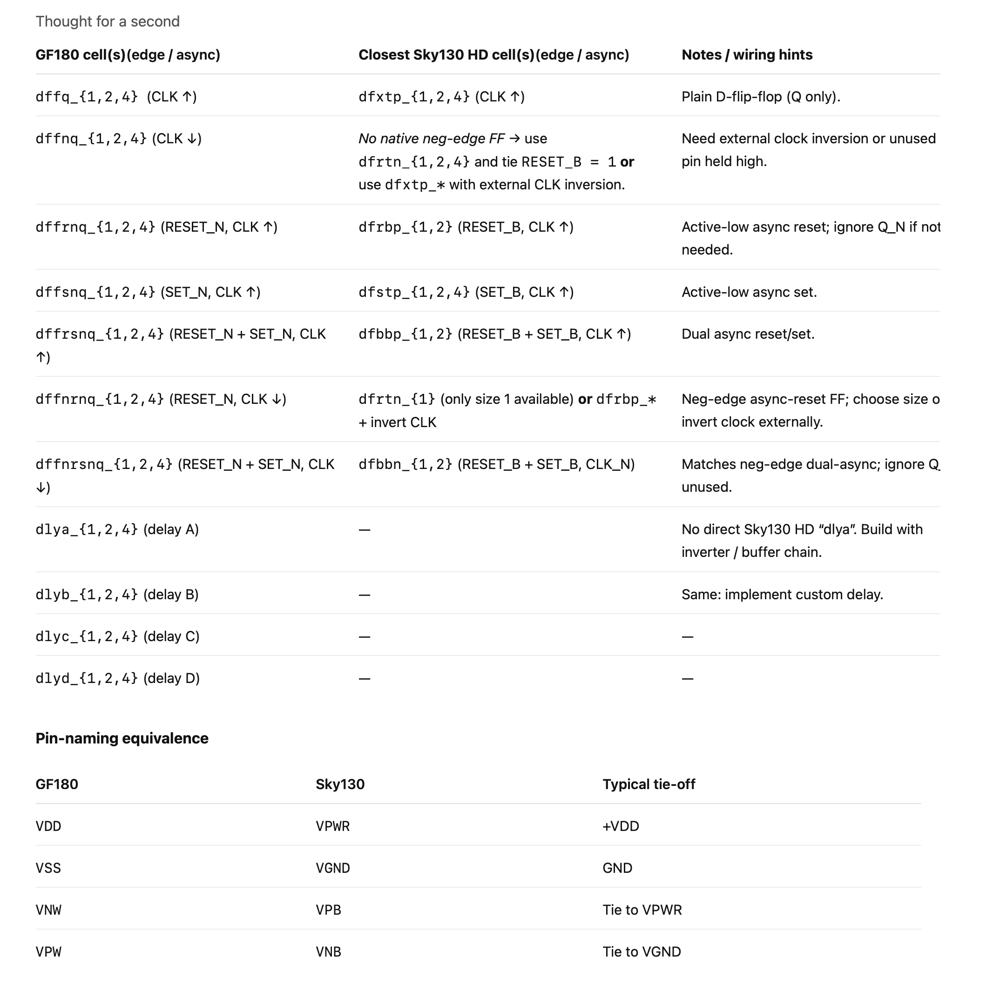

# Schematic Symbols for gf180mcu Standard Cells 

- Peter Kinget
- July 17 2025


## Symbol Creation

Doing the `gf180mcu_fd_sc_mcu9t5v0` to start. 

1. Copied the Sky130A symbols from `/foss/pdks/sky130A/libs.tech/xschem/sky130_stdcells` into `./sky130_stdcells_to_gf180mcu` folder
2. Updated several strings using `do_text_replacements.py` script taking care of the substitutions needed for *all* symbols

``` python
replacements = [
     ("prefix=sky130_fd_sc_hd__", "prefix=gf180mcu_fd_sc_mcu9t5v0__"),
     ("verilogprefix=sky130_fd_sc_hd__", "verilogprefix=gf180mcu_fd_sc_mcu9t5v0__"),
     ("VGND=VGND VNB=VNB VPB=VPB VPWR=VPWR", "VGND=VSSd VNB=VDDd VPB=VSSd VPWR=VDDd"),
     ( "@VGND @VNB @VPB @VPWR", "@VPWR @VNB @VPB @VGND")
]
```

3. The symbols do not have supply pins but are assuming VDDd and VSSd as digital supplies; these need to be defined in the schematic that calls the symbols (see examples under `tb_digital_cells`); the standard cells subcircuits further have a p-well and n-well terminal which are tied to VSSd and VDDa respectively. 

4. Did substitutions cell type by cell type to fix the pinout interfaces; these logic cells have been created:
- `nand2_{}`, `nor2_{}`, `inv_{}`, 

5. The flip-flop mapping is less straightforward since the two technologies have different types; the following have been created:
- `dffq_{1,2,4}` based on the `dfxtp{1,2,4}` sky130 symbol

## Digital Testbenches

- A couple of test benches have been created that use the symbols
- Check out the `tb_digital_cells` folder
- The schematics have the necessary `.include` statements to load the spice netlists for the digital standard cells. 
- The test benches are run at 3.3V, although the cells have a nominal supply of 5V. 

## Work in progress:

> Table provided by ChatGPT -- Use with caution!!

